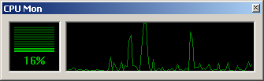



## CPU Monitor

### Description

This program can query the CPU usage on Windows 9x *and* Windows NT systems.

Most examples don't work on NT4 or older (including the examples found here on Planet Source Code), but this code does. It does this by calling an undocumented function (the same function TaskManager uses to get various Windows information).
 
### More Info
 

             |
---                |---
**Submitted On**   |2001-09-24 18:51:58
**By**             |[Pieter Philippaerts](https://github.com/Planet-Source-Code/PSCIndex/blob/master/ByAuthor/pieter-philippaerts.md)
**Level**          |Advanced
**User Rating**    |4.9 (94 globes from 19 users)
**Compatibility**  |VB 5\.0, VB 6\.0
**Category**       |[Windows System Services](https://github.com/Planet-Source-Code/PSCIndex/blob/master/ByCategory/windows-system-services__1-35.md)
**World**          |[Visual Basic](https://github.com/Planet-Source-Code/PSCIndex/blob/master/ByWorld/visual-basic.md)
**Archive File**   |[CPU Monito268929242001\.zip](https://github.com/Planet-Source-Code/pieter-philippaerts-cpu-monitor__1-27505/archive/master.zip)

